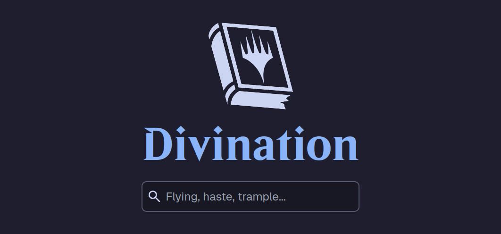

<p align="center">
  
</p>

# Overview

_Magic: The Gathering_ is widely known as a difficult and complex game. So complex, that it's even considered [turing complete](https://arxiv.org/abs/1904.09828). This complexity is not helped by the general inaccessibility of the comprehensive rules, with the latest version of the rules being [only officially available in PDF, DOCX, or TXT format](https://magic.wizards.com/en/rules) - with no way to search for specific rules.

Enter **_Divination_**, a website for searching Magic: the Gathering's Comprehensive Rules. You can enter any search query, and instantly get a list of all of the rules that match. You can even jump from a given rule to a [hosted version of the Comprehensive Rules](https://github.com/divination-nz/mtg-rules-html), and arrive exactly at the location where that rule is found.

With **_Divination_**, you'll never miss a ruling again. Start searching today: https://divination.nz/.

# Features

- Search for any of Magic's 1000+ rules
- Jump directly from a rule to the corresponding entry in the rulebook
- Supports the [OpenSearch](https://developer.mozilla.org/en-US/docs/Web/XML/Guides/OpenSearch) protocol, so you can treat Divination as a search engine in your favourite browser

# Development

## Prerequisites

Make sure you have these installed and working on your system:

- [Node.js](https://nodejs.org/)
- [Yarn](https://yarnpkg.com/)

Clone the repository:

```bash
git clone https://github.com/divination-nz/divination-web
```

Run `yarn` to install dependencies:

```bash
cd divination-web
yarn
```

> [!TIP]
> If you're using VSCode or [VSCodium](https://vscodium.com/), make sure to install the SDK:
>
> `yarn dlx @yarnpkg/sdks vscode`

## Run It Locally

First, run the development server:

```bash
yarn dev
```

Open [http://localhost:3000](http://localhost:3000) with your browser to see the result.

## Tech Stack

- [Next.js](https://nextjs.org/)
- [Tailwind CSS](https://tailwindcss.com/)
- [Iconify](https://iconify.design/)
- [Divination API](https://api.divination.nz/)
